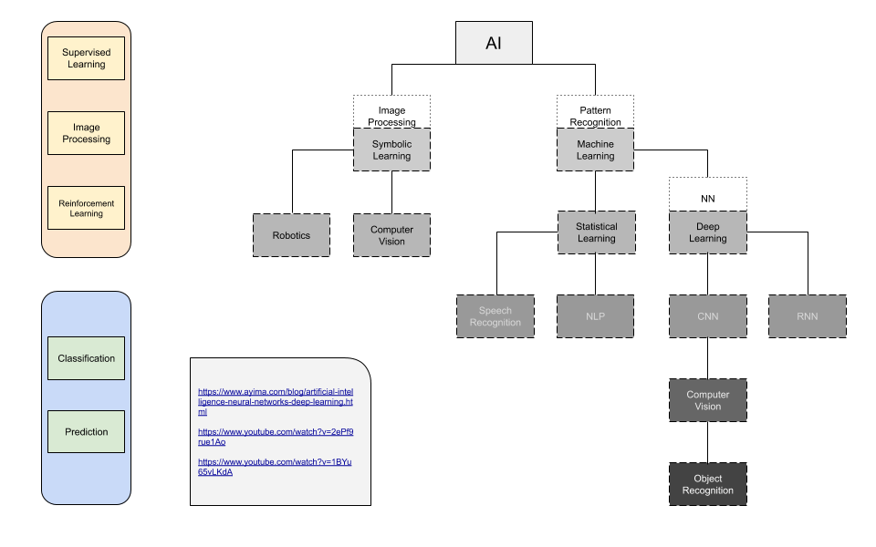
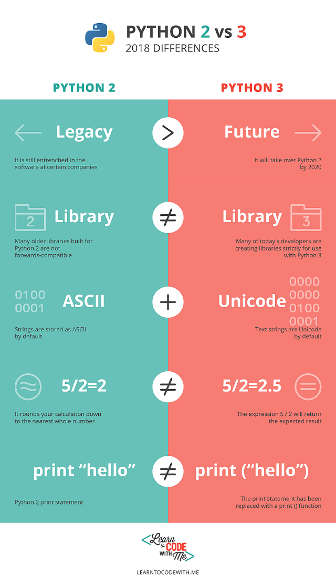

# Entry 2
##### 11/17/2019

### Update
A lot had happened during the past few weeks. I have changed my language from Ruby to Java and then to Python. This is mainly because I was still in the experimental phase. As mentioned in the previous [Blog Entry](entry01.md) I was going to make a game with Ruby because of it’s potential in game development. It quickly came my to notice that Ruby really isn’t fit for game development especially for beginners. I shift my focus to Java, a language that is capable of doing anything. I found interesting tutorials on Youtube documenting the process of making a game. I then decided to switched to Python on a short notice due to my interest in AI along with the encouragement from my teacher, Mr. Mueller. I still have a bit of suspicion on how I can apply AI to [Halite](https://2018.halite.io/), a game my partner ZhiYuan informed me about.
### Inspiration
Artificial Intelligence has been a topic that I wanted to explore with for a long time. The general purpose of AI is to simplify normal tasks and solve long or impossible assignments. This field had been developed and prove to be really useful in many ways. There are countless real world application that is being used right now and many more to come. However, I was discouraged by the complexity of Neural Network, a branch of AI that is present in most projects. I know that it isn’t an easy feat until I figured out that there is someone in particular who can aid me in this project.
### Engineering Design Process
The **goal** (rather than the **problem**)for this project is to make functional bots that will eventually compete with each other in the game engine provided by Halite. After a quick thought while writing Blog Entry #2 I felt that this goal is pretty lackluster and inapplicable to AI in a way so I decided to add a twist. Hopeful it would turn out just right but my goal new goal is to training a bot to win through the power of machine learning. In my opinion this sounds a lot better than the previous goal.

As for the **research** part of this project, it is kind of an ongoing process. I found many good sources about my topic and hopefully get to familiarize with it. Of cources I will be keep on adding to the list.<br><br>
- [General AI Explanation](https://www.ayima.com/blog/artificial-intelligence-neural-networks-deep-learning.html)<br>
- [Neural Network](https://towardsdatascience.com/the-mostly-complete-chart-of-neural-networks-explained-3fb6f2367464)

<br>


A table I made to organize my thought while brainstorming<br>



Brainstorming had cause me some trouble. It is particularly hard to think of anything that is related to this project. Halite first reminded me of the dozens of strategic games like Sid Meier’s Civilization and Starcraft but it really is hard to apply. The Eureka moment came when I try to trace it back to origin and think simple. I thought of chess. When I think of chess I remember the exact case study that shares the same goal/problem with this project. Back in 1996 a world champion in chess was defeated by an Artificial Intelligence called [Deep Blue](https://en.wikipedia.org/wiki/Deep_Blue_(chess_computer)), that really marked the start the AI field. Similarly in 2016, [AlphaGo](https://en.wikipedia.org/wiki/AlphaGo), developed by Google, defeated a renowned Go player. With these studies in hand it boosted my confidence level and made me believe that this project is possible.
### Python
When it comes to Python there is a lot of familiarity when I code due to its many similarities in pretty much everything with Java. The only twist is that Python 2 is not the same as Python 3 as shown [here](https://learntocodewith.me/programming/python/python-2-vs-python-3/). The image below point out the obvious changes between the versions. Despite all that the differences isn’t that much so I can continue to rely on [W3 School](https://www.w3schools.com/python/) and [CodeAcademy](https://www.codecademy.com/learn/learn-python) for Python 2.<br>



### Knowledge
The course that I’m currently taking is AP Computer Science A which gives a general  overview on how to program in Java. The primary tool that I will be focusing on is Python which shares a lot of similarities with Java because of the fact that they are both Object-Oriented. As of now I am learning about Methods in AP CSA which can be comparable with with Class in Python. The terms might be really confusing because of the subtle difference they had from language to language.

##### In Java:
```Java
public class Car {
    private String color;
    private String model;
    private int year;

    public Car(String color, String model, int year) {
        this.color = color;
        this.model = model;
        this.year = year;
    }

    public String getColor() {
        return color;
    }

    public String getModel() {
        return model;
    }

    public int getYear() {
        return year;
    }
}
```

##### In Python:
```Python
class Car:
    def __init__(self, color, model, year):
        self.color = color
        self.model = model
        self.year = year
```

### Skills
For the past few weeks I was on my own doing what I need in order to make a game in Java. That change after I partnered up with [ZhiYuan](https://github.com/zhiyuanc1718). I was able to effectively work with him. Although it was only for one day of the week during Friday we were able to sort things out and get to work. In this case **Collaboration** is the skill that I need to have in order to have. Nevertheless **Communication** also played a role where we were able to chat throught school time due to common scheduling. We settle on Messenger as a preferable way of communication because of its simplicity and functionality.

##### Final Note:
There is still some uncertainty when it comes to AI because neural network in particular is still an Open Research Field meaning that there is a lot remain to be uncovered. Since the tool is set in stone, I do not have to luxury to turn back once again.


[Previous](entry01.md) | [Next](entry03.md)

[Home](../README.md)