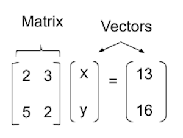

# Entry 5
##### 3/16/20

### Update
In the past weeks me and my partner ZhiYuan have continued our research on Machine Learning. I personally looked into the mathematical equations that are required in Machine Learning to better understand the code as well as familiarizing myself with syntax and method of the new python module mentioned in my previous blog entry. As of now we do have a Minimum Viable Product which is the algorithmic bot. However this does not conclude this project since we aim to make a Artificial Intelligence bot from the very beginning. My partners’s main focus as of now is improving the algorithmic bot. We hope that one day we can match the bot against each other to compare the strength and weakness of AI and algorithm.
<br><br>
### Engineering Design Process
As for the Engineering Design Process currently we are in the **planning** phase. We have decided to create a q-learning bot as mentioned in the previous blog entry but there is much to be done beside declaring where we are going. We touch upon a bit of the **prototype** phrase with the help of online tutorials.
<br><br>
### Knowledge
While going through the online ML Lessons provided by [Andrew Ng](https://online.stanford.edu/instructors/andrew-ng), professor at Stanford. I came across the topic of Vectors and Matrices which for me at first reminded me of arrays in Java. This familiarity soon came to an end as it is much more complex than that since you can apply mathematical operation to it.

<br><br>
### Skills
#### How to Google
Machine Learning is a popular topic. I find myself in an infinite loop of options and going through countless videos simply by googling the topic. One worthy mention is Tech with Tim, a youtuber that specialize in python, who has a neat website that broke down his code on his well documented [website](https://techwithtim.net/tutorials/machine-learning-python/introduction/).
<br>
#### Problem Decomposing
The tutorial that I went through on Halite 3 ML left me confused. After discussing with my partner he suggested that I try breaking it down and that's what I did.
<br><br>
### Plans

So far my knowledge on ML is limited and can be summarized by these links [here](https://www.toptal.com/machine-learning/machine-learning-theory-an-introductory-primer)
And [here](https://machinelearningmastery.com/introduction-matrices-machine-learning/#:~:text=A%20matrix%20is%20a%20two,(a%20table)%20of%20numbers.&text=It%20is%20more%20common%20to%20see%20matrices%20defined%20using%20a%20horizontal%20notation.&text=Further%2C%20a%20vector%20itself%20may,one%20column%20and%20multiple%20rows.). Which both of these links functions as a nice resource in understanding the elementary of ML. My plan now is to continue to look through Andrew Ng’s lesson as it does seem to help while I try decipher the codes from the other ML tutorials.

Although I have yet to grasp the function of these codes this is a part of the code from a tutorial that I follow. It is mostly responsible in training the bot via q-learning.
```Python
    if game.turn_number == constants.MAX_TURNS:
        dones[-1]=True
        # logging.info(f"{len(states)} - {len(action_indices)} - {len(rewards)} - {len(dones)}")
        total_reward = 0
        for state, next_state, action_index, reward, done in zip(states, states[1:], action_indices, rewards, dones):
            current_q = lookup_q_table(q_table, state)
            future_q = lookup_q_table(q_table, next_state)

            if done:
                current_q[action_index] = reward
            else:
                current_q[action_index] = LEARNING_RATE * current_q[action_index] + (1 - LEARNING_RATE) * (reward + DISCOUNT * np.max(future_q[:-1]))

            current_q[-1] += 1

            q_table[state2key(state)] = current_q

            total_reward+=reward if reward>0 else 0

            logging.info(f"{state2key(state)} | {POSSIBLE_MOVES[action_index]} | {reward} | {done} | {[round(x, 2) for x in current_q]}")

        logging.info(f"Writing to {TABLE} - {len(q_table)} - {len(states)} - {total_reward}")
        with open(TABLE, 'w') as f:
            f.write(json.dumps(q_table))
```

[Previous](entry04.md) | [Next](entry06.md)

[Home](../README.md)


